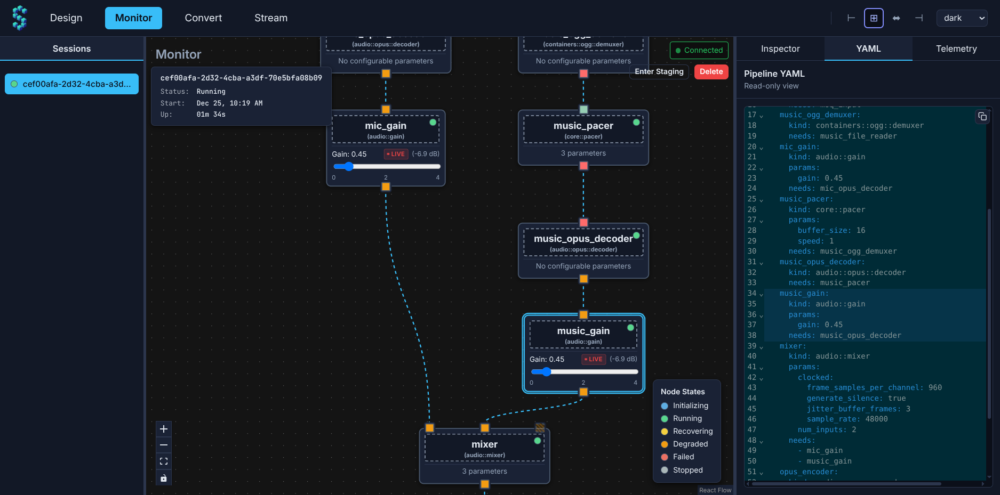

<!--
SPDX-FileCopyrightText: © 2025 StreamKit Contributors

SPDX-License-Identifier: MPL-2.0
-->

<h1 align="center">
  <br>
  
  <br>
  StreamKit
  <br>
</h1>
<h4 align="center">Build and run real-time media pipelines on your own infrastructure</h4>
<p align="center"><em>Speech-to-text, voice agents, live audio processing — composable, observable, self-hosted.</em></p>
<p align="center">
  <a href="https://streamkit.dev"></a>
  <a href="https://demo.streamkit.dev"></a>
  <a href="LICENSE"></a>
</p>
<br>

<p align="center">
  
  <br>
  <em>Pipeline monitor showing real-time audio processing with node metrics</em>
</p>

**StreamKit** is a self-hostable media processing server (written in Rust). You run a single binary (`skit`), then compose pipelines as a node graph (DAG) made from built-in nodes, plugins, and scriptable logic — via a web UI, YAML, or API.

It operates in two distinct modes:

1. **Dynamic (Real-time):** Long-running, interactive sessions (voice agents, live streams) that you can patch and tune live via the Web UI or WebSocket API.
2. **Oneshot (Stateless):** Request/response processing (batch transcription, file conversion) via a simple HTTP API.

Define your pipeline once, run it how you need.

## Contents

- [Project status](#project-status)
- [Use cases](#use-cases)
- [Core concepts](#core-concepts)
- [Quickstart (Docker)](#quickstart-docker)
- [What's included](#whats-included)
- [Development](#development)
- [Coding agents](#coding-agents)
- [Docs & links](#docs--links)
- [Acknowledgments](#acknowledgments)
- [License](#license)

## Project status

StreamKit is still in its infancy and very much a work in progress. It's usable for tinkering and building prototypes, but it is not yet "production-hardened".

Please keep in mind:

- **Breaking changes** are likely (configs, APIs, node behavior, pipeline formats).
- **Docs/tests are incomplete** and you may run into sharp edges, UI quirks, or missing features.
- **Performance and security** haven't been fully audited; avoid exposing it to untrusted networks unless you've reviewed and hardened your deployment.
- **Linux x86_64 only** today (ARM and other platforms are on the roadmap).

If you try it and something feels off, please open an issue (or a small PR). For live help, join our [Discord](https://discord.gg/dcvxCzay47).

## Use cases

- **Speech pipelines** — Build a transcription service: ingest audio via MoQ, run Whisper STT, stream transcription updates to clients.
- **Real-time translation** — Bilingual streams with live subtitles using NLLB or Helsinki translation models.
- **Voice agents** — TTS-powered bots that respond to audio input with Kokoro, Piper, or Matcha.
- **Audio processing** — Mixing, gain control, format conversion, and custom routing.
- **Batch processing** — High-throughput file conversion or offline transcription using the Oneshot HTTP API.
- **Your idea** — Add your own node or plugin and compose it into a pipeline

## Core concepts

- **Pipelines** are node graphs (DAGs) that process real-time streams and requests.
- **Execution modes**:
  - **Oneshot**: stateless request/response pipelines (batch over HTTP)
  - **Dynamic**: long-running sessions you can inspect and reconfigure while they run
- **Transport**: real-time media over MoQ/WebTransport (QUIC) plus a WebSocket control plane for UI and automation (WebSocket transport nodes are on the roadmap; in the near term, non-media streams may also ride MoQ)
- **Plugins**: native (C ABI, in-process) and WASM (Component Model).
- **Media focus**: audio-first today (Opus, WAV, OGG, FLAC, MP3). Video support is on the [roadmap](ROADMAP.md).

## Quickstart (Docker)

The fastest way to get started is using pre-built Docker images from GitHub Container Registry (GHCR). The image serves the web UI and includes sample pipelines.

> [!CAUTION]
> StreamKit does not currently implement authentication. Do not expose it directly to the public internet. Bind to localhost (recommended) or put it behind an authenticating reverse proxy and a trusted role header. See <https://streamkit.dev/guides/security/>.

> [!NOTE]
> Official Docker images are published for `linux/amd64` (x86_64). On ARM hosts (Raspberry Pi, Apple Silicon, etc.), use “Build from Source” or run with amd64 emulation.

### CPU-only

```bash
docker run --rm \
  -p 127.0.0.1:4545:4545/tcp \
  -p 127.0.0.1:4545:4545/udp \
  ghcr.io/streamer45/streamkit:latest \
  skit serve # optional: this is the image default

# Open http://localhost:4545 in your browser
# Press Ctrl+C to stop
```

### Next steps

- Open the UI at `http://localhost:4545` and load an example from the **Samples** list (bundled in the image under `/opt/streamkit/samples/pipelines`).
- See [DOCKER.md](DOCKER.md) for volumes, env vars, GPU verification, and troubleshooting.
- For GPU acceleration (selected plugins), see the docs: <https://streamkit.dev/deployment/gpu/>

## What's included

- Low-latency, real-time pipelines with backpressure and streaming semantics
- Node graph model (DAG) with built-in nodes plus modular extensions
- Web UI for building/inspecting pipelines and a client CLI (`skit-cli`) for scripting (included in GitHub Release tarballs)
- Load testing + observability building blocks (see `samples/loadtest/` and `samples/grafana-dashboard.json`)
- Optional ML plugins + models (mounted externally by default): Whisper/SenseVoice (STT), Kokoro/Piper/Matcha (TTS), NLLB/Helsinki (translation). Some models may have restrictive licenses (e.g. NLLB is CC-BY-NC); review model licenses before production use.

## Development

StreamKit is a Rust workspace with a React web UI (builder + monitor) (Vite + Bun). Most tasks are wrapped in `just`:

```bash
just dev   # backend + UI (hot reload)
just test  # Rust + UI tests
just build # release build
```

See [CONTRIBUTING.md](CONTRIBUTING.md) for prerequisites and setup, or run `just --list` for all commands.

## Coding agents

Contributions made with coding agents (Claude/Codex/etc.) are welcome, but should be **supervised** and **reviewed by a human** before merge. Treat agent output like untrusted code: verify correctness, security, licensing, and style.

See [AGENTS.md](AGENTS.md) for repo-specific agent guidance.

## Docs & links

- [streamkit.dev](https://streamkit.dev) - Documentation site (source in `docs/`; run `just docs` locally)
- [ROADMAP.md](ROADMAP.md) - Planned features and milestones toward v1.0
- [DOCKER.md](DOCKER.md) - Docker deployment guide (CPU/GPU images)
- [Systemd Deployment](https://streamkit.dev/deployment/systemd/) - Install from GitHub Releases and run via `systemd`
- [samples/pipelines/](samples/pipelines/) - Example pipelines you can load and adapt
- [samples/loadtest/](samples/loadtest/) - Load test configs for `skit-cli lt`
- [MoQ](https://moq.dev/) - Media over QUIC (MoQ) project
- [Discord](https://discord.gg/dcvxCzay47) - Community server

## Acknowledgments

- Huge credits to the [**Media over QUIC (MoQ)** project](https://github.com/moq-dev/moq). StreamKit's real-time functionality heavily relies on it.

## License

Mozilla Public License 2.0 - see [LICENSE](LICENSE) for details.
